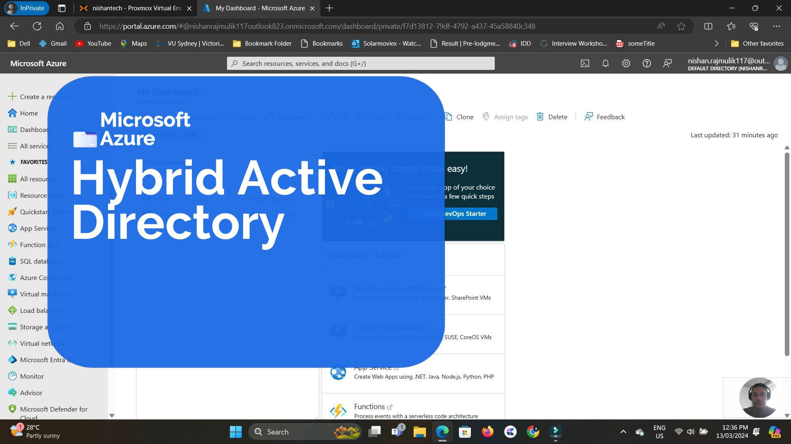

# Microsoft Hybrid Active Directory (On-Prem AD + Microsoft Entra ID)

## Overview
This project demonstrates the implementation of a **Hybrid Identity environment** by integrating an **on-premises Active Directory** with **Microsoft Entra ID (Azure Active Directory)** using **Microsoft Entra Connect (Azure AD Connect)**.

The objective was to enable synchronisation of on-premises Active Directory users to Microsoft Entra ID, allowing centralised identity management across both on-premises and cloud environments. This setup reflects a **real-world enterprise hybrid identity architecture** widely used during cloud migrations.

---

## Technologies Used
- Windows Server (On-Premises Active Directory Domain Services)
- Microsoft Entra ID (Azure Active Directory)
- Microsoft Entra Connect (Azure AD Connect)
- Active Directory DNS
- Azure Portal

---

## Architecture Overview
The hybrid identity architecture consists of:
- An **on-premises Active Directory domain**
- A **Microsoft Entra ID tenant**
- **Microsoft Entra Connect** acting as the synchronization bridge

**Identity Flow:**

On-Prem Active Directory  
⬇  
Microsoft Entra Connect  
⬇  
Microsoft Entra ID (Hybrid Directory)

---

## Implementation Steps

### Step 1: On-Premises Active Directory Preparation
An on-premises Active Directory environment was configured with:
- Active Directory Domain Services (AD DS)
- DNS services
- User accounts created within the domain

These users represented enterprise identities intended for cloud synchronisation.

---

### Step 2: Microsoft Entra ID Tenant Setup
A Microsoft Entra ID tenant was prepared in the Azure Portal to serve as the cloud-based identity provider. This tenant was used to receive and manage synchronized identities from the on-premises directory.

---

### Step 3: Installing Microsoft Entra Connect
Microsoft Entra Connect (Azure AD Connect) was installed on the on-premises server to establish a secure connection between:
- On-premises Active Directory
- Microsoft Entra ID

This tool enables directory synchronisation and hybrid identity functionality.

---

### Step 4: Establishing Directory Synchronisation
During configuration:
- A new synchronisation service was created
- Secure communication between on-prem AD and Entra ID was established
- The directories were successfully connected

This enabled replication of identities from the on-premises environment to the cloud.

---

### Step 5: Configuring Synchronisation Rules
Synchronisation rules were configured to:
- Ensure correct replication of on-premises users
- Map Active Directory user attributes to Microsoft Entra ID attributes
- Maintain consistency of identity data across environments

Proper attribute mapping ensured accurate identity synchronisation.

---

### Step 6: Monitoring and Validation
The synchronisation process was monitored by:
- Reviewing synchronisation logs in Microsoft Entra ID
- Verifying replicated users in the Azure Portal
- Troubleshooting any synchronisation issues

This confirmed the successful operation of the hybrid identity setup.

---

## Results
- On-premises Active Directory users were successfully synchronised to Microsoft Entra ID
- Hybrid identity functionality was validated
- User accounts were visible and manageable in the Azure Portal
- Synchronisation operated without critical errors

---

## Screenshots

### Microsoft Entra ID - Hybrid Active Directory Dashboard

---

## Video Demonstration
▶️ [Watch the Hybrid Active Directory Demo](https://youtu.be/HyVbGK06D1o)

---

## Security Considerations
- Secure communication between on-premises and cloud directories
- Least-privilege principles followed during configuration
- Synchronisation logs monitored for health and errors
- Microsoft-recommended hybrid identity practices applied

---

## Key Learnings
- Understanding hybrid identity architecture
- Hands-on experience with Microsoft Entra Connect
- Directory synchronisation and attribute mapping
- Monitoring and troubleshooting identity sync issues
- Real-world enterprise identity integration

---

## Future Enhancements
- Implement Password Hash Synchronisation (PHS) or Pass-Through Authentication (PTA)
- Enable Hybrid Azure AD Join for devices
- Integrate Microsoft Defender for Identity
- Apply Conditional Access policies for enhanced security
